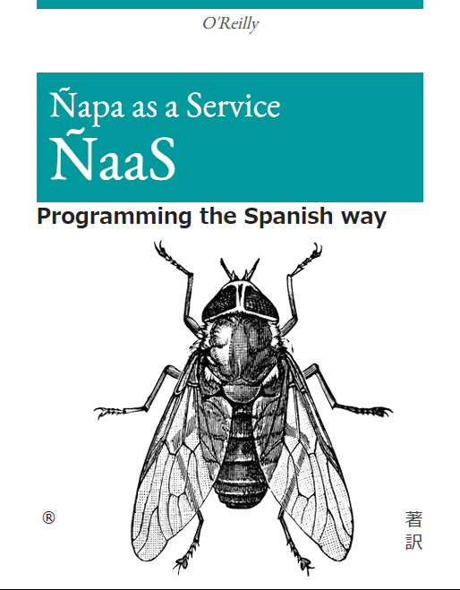
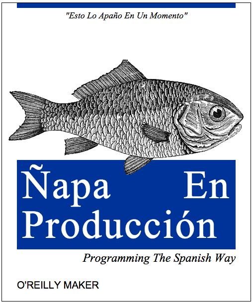

# O'Reilly "B2B Services for ~~dummies~~ Joses"

## @b2b/service-next

- Is a framework based in express created to propagate evolutions more easily (we have a huge amount of services and microservices that need to be maintained/evolved)
- The framework allows the developer to focus in their Jira tickets
- We have 50% of the projects using @b2b/service that need to be migrated
- @b2b/service-next configs are smaller because the framework manages a huge list of ENV vars for you.
- @b2b/service-next **only** supports [OPENAPI v3.0.3](https://spec.openapis.org/oas/v3.0.3) (Swagger support has been removed)
- @b2b/service is not receiving updates anymore => migrate to @b2b/service-next
- @b2b/service and @b2b/service-next are not "La churrera"
- Do we say microservice or micro API? both
- Do we say service or API? both
- Documentation at: https://bit.ly/b2bservice-next

## ENV vars

We use environment variables to change configurations between environments (local, development, production) and to inject secrets during the CloudRun.

If the project is not too old, you will find the ENV vars that the project needs into the project's README. If not, I invite you to complete it.

[Here](https://github.com/ingka-group-digital/b2b-shared-nodejs/blob/main/packages/b2b-service-next/documentation/config.md#env-variables) you can find a list of all the ENV variables you could use with @b2b/service-next

:warning: About `GOOGLE_APPLICATION_CREDENTIALS` env var: this variable is only needed in your local and is the **absolute path** to the json file that contains the **credentials to access Firestore**. 

:warning: **Do not push this credentials file** to the repo, keep it outside the project's directory (in the parent dir for example or somewhere in your home dir you could reuse in all projects)

:warning: **Do not push any secret** to the repo

## Running a project

Create a **launch.json** file into your project's **.vscode** directory. 

This is the easiest way to set up all the [**environment variables**](https://www3.ntu.edu.sg/home/ehchua/programming/howto/Environment_Variables.html) you need to run the service (**and your project will be ready for debugging!**):

```javascript
{
  // Use IntelliSense to learn about possible attributes.
  // Hover to view descriptions of existing attributes.
  // For more information, visit: https://go.microsoft.com/fwlink/?linkid=830387
  "version": "0.2.0",
  "configurations": [
    {
      "console": "integratedTerminal",
      "name": "dev/default",
      "request": "launch",
      "runtimeArgs": ["run-script", "dev"],
      "runtimeExecutable": "npm",
      "skipFiles": ["<node_internals>/**"],
      "type": "node",
      "env": {
        "LOG_LEVEL": "debug",
        "PORT": "3001"
        //"GOOGLE_APPLICATION_CREDENTIALS": "./firestore.json"
      }
    },
    {
      "console": "integratedTerminal",
      "name": "productions",
      "request": "launch",
      "runtimeArgs": ["run-script", "dev"],
      "runtimeExecutable": "npm",
      "skipFiles": ["<node_internals>/**"],
      "type": "node",
      "env": {
        "LOG_LEVEL": "debug",
        "NODE_ENV": "production",
        "PORT": "3001"
        //"GOOGLE_APPLICATION_CREDENTIALS": "./firestore.json"
      }
    },
    {
      "console": "integratedTerminal",
      "name": "localhost",
      "request": "launch",
      "runtimeArgs": ["run-script", "dev"],
      "runtimeExecutable": "npm",
      "skipFiles": ["<node_internals>/**"],
      "type": "node",
      "env": {
        "LOG_LEVEL": "debug",
        "PORT": "3001",
        "NODE_ENV": "localhost"
        //"GOOGLE_APPLICATION_CREDENTIALS": "./firestore.json"
      }
    }
  ]
}
```

Note: check the project's `README.md` for the env vars needed.

The example above had set 3 environments that are very strongly close to the **./config/** directory of your service:

- dev/default: default environment
- production: sets `NODE_ENV` env variable to _production_
- localhost => sets `NODE_ENV` env variable to _localhost_

So by setting a value into `NODE_ENV` variable, our framework will use this value to get the needed configuration from `./config/xxxxx.js` files.

In the other hand, the application will be launched using the dev script (`npm run dev` + the ENV vars) that launch the service with nodemon (the project will be reloaded on file changes).

Note: `NODE_ENV=localhost` will try to read `./config/localhost.js` that probabily it has not been already created due is included into the .gitignore. **You need to avoid pushing this file into the repo!**

Check this doc: https://bit.ly/b2b-service-next-config

## Steps for adding new endpoints to a project

### The route
Add the new route at `./src/openapi/routes.yml` following some API Rest best practices:

- add versioning to endpoint
  - :o: `/v1/us/en/cart`
- use nouns instead of verbs: **the methods are the verbs! (GET, POST, PUT, DELETE, PATCH)**
  - :x: `/v1/createCheckout?country=us&language=en`
  - :x: `/v1/getCheckout?id=CHECKOUT_ID&country=us&language=en`
  - :x: `/v1/editCheckout?id=CHECKOUT_ID&country=us&language=en`
  - :x: `/v1/removeCheckout?id=CHECKOUT_ID&country=ES`
  - :o: POST `/v1/us/en/checkout`
  - :o: GET `/v1/us/en/checkout/CHECKOUT_ID`
  - :o: PUT `/v1/us/en/checkout/CHECKOUT_ID` or (PATCH)
  - :o: DELETE `/v1/us/en/checkout/CHECKOUT_ID`
- name collections with plurals => 
  - :x: `/v1/us/en/product`
  - :o: `/v1/us/en/products`
  - :o: `/v1/us/en/products/PRODUCT_ID` (getting a specific product from the list of products)
- nest endpoints to show relationships => 
  - :o: `/v1/us/en/products/PRODUCT_ID/variants` (variants of PRODUCT_ID)
  - :o: `/v1/us/en/products/PRODUCT_ID/price` (price of PRODUCT_ID)
  - :o: `/v1/us/en/products/PRODUCT_ID/availability` (availability of PRODUCT_ID)
- use query params (?) for filtering, sorting, paginate...
  - :o: `/v1/us/en/products?size=20&page=1&sort=PRICE&filter=white-color`

### Action definitions

Add into `./src/openapi/actions` (or a similar directory depending on how old is the project) a yaml file with the definition (parameters, responses) for all the methods of the url. ([check this example](./b2b-mm-test-api/src/openapi/actions/cats.yml)).

Important: for each methods, you will find the property `operationId` that is strong related with the controller's name.

### Controllers

DOC: https://bit.ly/b2bservice-next-vs-controllers

Create a new file into `./src/controllers` (for example `products.js`). In the same file, you could include all the actions (methods) related to the endpoint (all the [CRUD](https://www.codecademy.com/article/what-is-crud) all together if you needed it).

Exports each action to ensure they will be accesible.

For example:

```javascript
//./src/controllers/products.js
module.exports.get = async (req, res) => {};
module.exports.create = async (req, res) => {};
module.exports.update = async (req, res) => {};
module.exports.delete = async (req, res) => {};
```


```javascript
//./src/controllers/index.js
module.exports['v1.products.detail'] = require('./products.js').get;
module.exports['v1.products.create'] = require('./products.js').create;
module.exports['v1.products.update'] = require('./products.js').update;
module.exports['v1.products.delete'] = require('./products.js').delete;
```

Note that **we are using the _operationId_ as key in the index.js** module.exports...

```yaml
# ./src/openapi/actions/products.yml
get:
  operationId: v1.products.detail
  summary: List of products
...
post:
  operationId: v1.products.create
  summary: List of products
...
put:
  operationId: v1.products.update
  summary: List of products
...
delete:
  operationId: v1.products.delete
  summary: List of products
...

```

```yaml
# ./src/openapi/routes.yml
...
/v1/{retailUnit}/{language}/products/{productId}
  $ref: "./actions/products.yml"
```

## Important files and directories of a modern service/microservice project

- config
  - default.js
  - production.js //config for production => default + production
- src
  - openapi: API definition in OpenAPI format
  - controllers
  - providers: providers of data (APIs, databases...)
    - parsers (:arrow_up: :construction: next proposal)
  - ~~components~~: (:arrow_down: legacy) providers/datasources
  - parsers (current location): parsers or transformations of providers/datasources
  - ~~transformers:~~ (:arrow_down: legacy) parsers or transformations of providers/datasources
  - index.js: main app
  - options.js: the way to get current config depending on `NODE_ENV`
  - constants.js: **centralizes all the constants** of the app are
- sys
  - node
    - Dockerfile: the one we are using to deploy (BTW we use [nodejs LTS (alpine)](https://github.com/nodejs/release#release-schedule) image) => **please use LTS node ver in your local**
- .gitignore
- package.json
- README.md: with important info about the project, how to run it, debug it, ENV vars needed...

### Directory levels

We are trying to keep 1 level from `./src` and adding an `index.js` in the directories so we ca do:

```javascript
//provider
...
const { product: parser } = require('../parsers');
const { api } = require('../options');
const { MAX_NUM_PRODUCTS } = require('../constants');

module.exports.get = async ({retailUnit, language, transactionId} = {}) => {
...
```

```javascript
//controller
const { product, checkout } = require('../providers');
const { DEFAULT_X } = require('../options');

module.exports.get = async(req, res) => {
...
```

By making everything "requirable" at `../xxxx` level makes you faster not thinking on "where is located the provider or xxxx I need"

## Examples
Open [b2b-service-cats.code-workspace](./b2b-service-cats.code-workspace) in VSCode or both projects in separate VSCode windows.

- [b2b-mm-test-api](./b2b-mm-test-api/) is a microservice example that will connect to an external service to get data
- [b2b-service-cats](./b2b-service-cats/) is an external service that retrieves cat's data

## Documentation
- [@b2b/service-next framework](https://github.com/ingka-group-digital/b2b-shared-nodejs/tree/main/packages/b2b-service-next/README.md)
- [@b2b/service framework](https://github.com/ingka-group-digital/b2b-shared-nodejs/blob/main/packages/b2b-service/documentation/README.md)
- An article about [API Rest best practices](https://www.freecodecamp.org/news/rest-api-best-practices-rest-endpoint-design-examples/)

## Other O'Reilly books...



